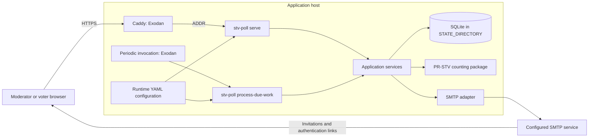

# Application architecture

**Status:** Draft architecture for the first implementation. The components and
paths below are proposed; this repository does not yet contain application code.

**Last updated:** 8 September 2026.

The application will be a **single Go application with internal modules**,
server-rendered HTML, and a local SQLite database. One binary will provide the
web server and a command for processing due work. Exodan will deploy and operate
it under its project integration contract.

The [README](../README.md#captured-requirements) holds the captured requirements.
The [vision](VISION.md) holds product intent, voter-facing copy, and open product
questions. This document defines application structure, technical boundaries,
data ownership, and runtime behaviour. Detailed interfaces, schemas, counting
rules, and acceptance criteria will follow in specification sheets.

## Architectural decisions

| Area | Direction and reason |
| --- | --- |
| Application | One Go module and binary, with explicit internal package boundaries. The initial service does not need independently deployed components. |
| Web interface | Standard-library `net/http`, `http.ServeMux`, and `html/template`. Ordinary HTML forms let Go own validation, state, navigation, and rendering. |
| Persistence | SQLite through `database/sql` and `modernc.org/sqlite`, following writeback's existing foundation. Transactions cover ballots, poll closure, and durable work without another server. |
| Counting | A separate Go package implementing the application's specified PR-STV rules, guided by the Irish system. It receives a frozen input and produces a result and count record without HTTP, SQL, or email dependencies. |
| Background work | Durable work records in SQLite, processed by a bounded command in the same binary. Exodan owns periodic invocation. |
| Email | An application-owned mail interface with an SMTP adapter, adapted from the sibling projects. Invitations and authentication use this boundary. |
| Deployment | Exodan owns build/deployment orchestration and host services. The application consumes its runtime configuration, storage, and scheduling contract. |
| Reuse | Adapt selected source into this repository first. Avoid making the first release depend on extracting a new shared framework. |

The initial deployment assumes one application host with local persistent
storage. SQLite suits this topology, but serializes writers. Multiple application
hosts or sustained write contention would require a fresh persistence decision;
sharing the database over a network filesystem is outside this architecture.
See SQLite's [deployment guidance](https://www.sqlite.org/whentouse.html).

The [modernc SQLite driver](https://pkg.go.dev/modernc.org/sqlite) is CGo-free and
supports `database/sql`. This fits Exodan's cross-compilation model without a
native database service or a target-side Go toolchain. Dependency versions will
be selected and pinned when the module is created.

## Runtime topology



The application-services box represents code linked into both command modes,
not a network service. The web process remains running; each scheduled command
performs a bounded sweep and exits. Both use the same configuration and local
database under the application's service identity.

The browser receives HTML and CSS. It does not calculate results, decide voting
eligibility, or maintain authoritative application state. No JavaScript is
required by this architecture. Any later exception must identify an interaction
that cannot reasonably be delivered by the Go server and native HTML.

## Application components and dependencies

| Component | Responsibility and dependencies |
| --- | --- |
| `cmd/stv-poll` | Selects `serve` or `process-due-work`, loads configuration, opens storage, and constructs dependencies. Owns process startup and shutdown. |
| `internal/web` | Routes, middleware, form decoding, presentation models, and template rendering. Calls application services; does not issue SQL or perform counts. |
| `internal/auth` | Issues and verifies magic-link grants and sessions. Resolves authenticated principals; poll services enforce authority over each requested poll and participant. |
| `internal/polls` | Application services for poll administration, participants, invitations, ballot replacement, closing, and result access. Owns transaction boundaries through the store. |
| `internal/count` | Counting model and PR-STV engine. Accepts a final ballot snapshot, winner count, and versioned rule inputs; returns the outcome and a structured count record. |
| `internal/store` | SQLite access, migrations, constraints, transaction support, snapshots, and durable work records. SQL stays inside this package. |
| `internal/automation` | Finds due polls and pending work, claims bounded batches, and invokes the same closing, counting, and delivery services used by application actions. |
| `internal/notify` | Builds invitation/authentication messages from approved copy and delivers through an injected mail interface. Owns transport outcomes, not ballot acceptance. |
| `internal/config` | Loads and validates Exodan's YAML layers and runtime paths. Exposes typed configuration without making other packages read the environment directly. |

Dependencies run from HTTP and CLI entry points into application services and
then into persistence, counting, and delivery. The counting package has no
upstream dependency on those entry points or on infrastructure. Small interfaces
at storage and external-delivery boundaries allow local substitutes during
verification; package construction uses ordinary Go constructors.

This layout follows Go's [server-module guidance](https://go.dev/doc/modules/layout#server-project).
Packages remain internal to the application. Model types live with the component
that owns their meaning, with explicit conversion into the counting input and
web presentation models.

## Server-rendered interaction

GET requests render pages. Form submissions use POST, are validated on the
server, and redirect after a successful mutation. Invalid submissions render the
form with the entered values and clear field-level errors. All state-changing
forms receive server-validated CSRF protection. The HTTP server applies bounded
request sizes, timeouts, and graceful shutdown.

The ballot page uses labelled rank inputs and a submit button. It supports
keyboard navigation and ordinary form submission without drag-and-drop or a
client-side state store. Native `details` elements or ordinary links provide the
help in [VISION.md](VISION.md#voter-facing-copy). The invitation and help copy are
presentation content; the count engine does not generate voting instructions.

Templates are parsed and checked at startup, adapting writeback's template cache.
Templates and static assets are deployed as read-only runtime directories under
Exodan's `data_dirs` contract. This retains the sibling applications' template
workflow without adding a frontend build system. Mutable data never lives beside
those assets.

Page handlers distinguish open, paused, closed, count-pending, and result-ready
conditions using application state. Those presentation conditions do not settle
open product questions such as whether a paused poll may resume or how its
deadline is handled.

## Identity and authorization

A poll participant has a stable identifier within that poll. Its associated
email addresses are contact and authentication routes. Every address-specific
grant resolves to the same poll and participant identifiers. The ballot is keyed
by that participant identity, so changing the mailbox used to authenticate does
not create another ballot.

The magic-link flow is:

1. The invitation service creates an access grant for an allowed address and its
   poll participant. Moderator login uses a distinct grant purpose and the
   configured moderator identity.
2. The mail adapter sends a link built from the supplied `base_url`.
3. The verification handler validates the grant's authenticity, purpose,
   validity, and association with the current participant or moderator.
4. The application establishes a session and redirects to a URL without the
   token. Session cookies are `HttpOnly`, `Secure` in deployment, and use an
   appropriate `SameSite` policy.
5. Each subsequent operation checks authority against the requested poll and
   participant, including when an identifier is supplied in a form or URL.

Writeback's identity-based token and stored token-hash pattern is the starting
point. STV Poll must add explicit grant purpose and poll scope. Session and
magic-link credentials remain distinguishable. Grant hashes and lifecycle state
belong in storage; raw tokens are excluded from logs and URL referrers.

Link lifetime, reuse, expiry recovery, and session lifetime remain product and
security specification decisions. If links are consumed once, validation and
consumption must be atomic. The architecture supports those policies without
assuming that possession of an email address grants authority over every poll.

Moderator eligibility is loaded from configuration, separately from participant
eligibility in the database. Whether moderators administer only their own polls,
and whether an invited moderator may vote, remains explicit product policy.
The authorization boundary must support those decisions without treating all
signed-in users as interchangeable.

## Persistence and consistency

SQLite is the authoritative store for application state. The database file lives
under `STATE_DIRECTORY`. Each command configures database connections consistently,
including foreign-key enforcement and bounded lock waits. Versioned application
migrations establish the schema before requests or work are accepted; migration
failure prevents the process from serving against a partial schema.

The logical relationships are:

- A **poll** owns its options, winner count, deadline, announcement preference,
  state, and participant list.
- A **poll participant** owns one or more contact addresses and at most one
  current effective ballot. Database uniqueness enforces this ballot boundary.
- A **grant** identifies its purpose and authorized principal. An invitation's
  delivery record identifies the intended address without becoming a voting
  entitlement of its own.
- A **closed poll** identifies a frozen count input. The count input and result
  retain their rule and application-version provenance.
- **Work and delivery records** retain pending operations, claims, attempts, and
  outcomes so that restarts do not discard unfinished work.

Reusing a participant list copies the grouped contact information into new
poll-participant records. It does not reuse ballot keys or mutate the earlier
poll. No global person registry is required for this model. Duplicate addresses
across separately entered participants still require the product policy recorded
in the vision.

### Ballot submission and closing

Ballot replacement runs in a transaction that checks participant authority,
validates rankings, and checks the poll's state and deadline before committing
the effective ballot. A version check prevents a stale browser form from silently
overwriting a newer accepted ballot; how that conflict is presented belongs in
the detailed interaction specification.

Closing uses the same persistence boundary: it stops further acceptance, freezes
the eligible ballot input, and records pending count work atomically. A concurrent
submission and close therefore have one database-defined order. A submission
cannot pass an earlier HTTP-only eligibility check and later alter a frozen
count.

The acceptance-time rule will be defined in the specification and implemented
once in the application service. It applies even when a scheduled sweep is late.
An Exodan timer wakes the processor; it does not determine whether a ballot was
on time.

Count inputs contain option identifiers and ranked preferences, without email
addresses. This limits the data the counting component needs. It does not promise
anonymous ballots: the database still contains the participant-to-ballot
association. Retention and access to that association remain product decisions.

## Counting, work processing, and announcement

The counting engine is an application-owned Go package. Its inputs are the frozen
ballots, options, number of winners, rule version, and any ordering or selection
inputs required by the chosen rules. Its outputs are the winning options and a
structured record of the count, including quotas, transfers, exclusions, and
termination.

The [counting direction](VISION.md#why-irish-pr-stv) is PR-STV guided by the Irish
system. The approved application specification governs surplus selection, ties,
transfer order, and termination. Wikipedia and legislation are reference
material; statutory conformity, legislative amendment tracking, and
election-administration procedures are outside the application contract.

A generic STV library is not interchangeable merely because it accepts ranked
ballots: it must implement the application's specified rules. Where those rules
require drawing lots or selecting ballots, the software captures the decision
inputs and outcomes needed to reproduce the count. Changes to the selected
algorithm must be explicit and reviewed.

The runtime flow is:

1. A deadline sweep or authorized manual close calls the same poll-closing
   service. The close transaction creates one count input and pending work record.
   Pausing alone never creates count work.
2. `process-due-work` claims pending work. It calculates outside the database
   write transaction, so a count does not hold the writer lock while it runs.
3. A result transaction stores the outcome and count record against that input,
   marks the work successful, and creates an announcement intent only when the
   poll's setting calls for one. A uniqueness boundary prevents a retry from
   creating a second authoritative result or announcement intent.
4. Results become available to authorized moderator requests. Announcement work
   is attempted after the result commits. A delivery failure cannot undo the
   result or remove moderator access.

The HTTP close action records the work and renders its pending status; it does
not hold a browser connection open for the entire count. The periodic command
processes closing, counting, and delivery in dependency order so newly produced
work can progress during the same invocation, within its execution bounds.

The **announce the winner immediately** preference means announcement becomes
eligible as soon as the result is committed. The channel and message remain open
product decisions. The architecture separates that intent from invitations and
SMTP, so it does not accidentally choose email or public result visibility as
announcement policy. With the checkbox clear, no system announcement is created.

### Recovery and delivery

Claims and outcomes are stored durably, with bounded claims that can be recovered
after a crash. Retries use the same frozen input and recorded decision inputs.
The processor reconciles current database state on every invocation rather than
assuming every scheduled tick occurred. Counts that cannot be processed remain
visible as pending or failed work; the service must not invent a result.

Invitations are recorded for every recipient address before delivery is
attempted. A durable delivery queue, adapted from writeback's automation pattern,
keeps email failures separate from poll and ballot transactions. SMTP runs
outside write transactions with bounded transport time and a configured secure
transport policy. Retry timing and terminal-failure presentation are specification
work. SMTP acceptance does not prove inbox delivery, and a crash after acceptance
can cause a retry to send a duplicate message; no exactly-once delivery guarantee
is implied.

## Exodan integration

The consumed authority is Exodan's
[Project Integration Contract](https://github.com/tigger-developer/exodan/blob/master/deploy/docs/PROJECT-INTEGRATION.md),
version 1.8, updated 25 August 2026, read for this draft. The application follows
its active NixOS contract. Exodan remains the authority if its contract changes.

| Owner | Responsibilities |
| --- | --- |
| STV Poll | Go binary, application commands, HTML/CSS assets, typed configuration semantics, authentication, poll rules, SQLite schema and migrations, counts, delivery intent, and application health. |
| Exodan | Build and deployment orchestration, Caddy, DNS, TLS, firewall, service identity and sandbox, host resources, secret decryption, periodic invocation, backup/restore orchestration, log collection, and host monitoring. |

Exodan cross-compiles the Go application for `linux/amd64` from the operator
machine and deploys the resulting binary. The initial application has no native
command dependency, so it does not require a `dependencies/nix` declaration.
Runtime templates and static assets are declared in `data_dirs`. Deployment uses
committed and pushed source through the infrastructure workflow.

### Runtime contract

| Input | Application use |
| --- | --- |
| `ADDR` | Bind the HTTP listener to the supplied address exactly. Caddy provides the public endpoint; the app does not choose a public host port or parse addresses by splitting on colons. |
| `DEFAULT_CONFIG_PATH` | Load the base application YAML. |
| `CONFIG_PATH` | Overlay the selected host's application YAML. |
| `SECRETS_PATH` | Overlay the decrypted secrets YAML when supplied. The application never decrypts an `.age` file itself. |
| `STATE_DIRECTORY` | Store the SQLite database and all other persistent mutable application data. |
| `XDG_RUNTIME_DIR` | Use for subprocess runtime state if a future application dependency needs it. No such dependency is selected here. |
| Process working directory | Resolve declared read-only runtime assets such as `templates/` and `static/`. |

Configuration precedence is defaults, host YAML, then decrypted secrets. The
loader validates the merged configuration at startup. An explicitly supplied
but unreadable layer is an error; required values must not silently disappear
through a fallback. These checks concern configuration loading and application
settings; URL and domain validation belong to Exodan. The application consumes
the supplied `base_url` to construct invitation links. Request `Host` headers do
not determine authentication-link destinations.

The operator clarified this boundary on 8 September 2026. The earlier proposal
for application-level `base_url` validation is withdrawn. Exodan owns domain
validation, DNS, routing, and public TLS; the application consumes its runtime
contract.

The contract uses `config/defaults.yaml`, `config/<host>.yaml`, and encrypted
`secrets/<host>.yaml.age`. Local development may use ignored
`secrets/localhost.yaml`. These paths are part of the proposed application
layout, not files already present in this repository.

### Scheduled work and operations

The application declares routine intent for `process-due-work`; Exodan creates
and runs the host timer. Its interval grammar has a minimum of one minute. The
selected interval and acceptable close-to-result latency must be reconciled in
the detailed specification and deployment configuration. Voting deadlines remain
enforced by the application independently of that interval.

The command uses the same runtime contract as `serve`, processes a bounded batch,
and reports failure through its exit status and structured logs. The application
does not install host timers, cron jobs, service units, or application-owned SSH,
deploy, logs, or status wrappers.

Application health reports whether the server can use its required state and
schema; dependency failure must not return a misleading healthy response. Logs
record operation outcomes and identifiers without magic-link tokens, raw session
credentials, or ballot contents. Exodan owns collection and host monitoring.

The storage design must provide a consistent SQLite backup boundary for Exodan's
backup workflow. Backup integration must account for any journal files and
concurrent writes; copying a live main database file alone is not an assumed
recovery mechanism. Application migration compatibility and infrastructure
rollback/restore must be assessed together before deployment.

## Proposed repository layout

```text
cmd/stv-poll/main.go
internal/
  auth/
  automation/
  config/
  count/
  notify/
  polls/
  store/
    migrations/
  web/
templates/
static/
config/
  defaults.yaml
  <host>.yaml
secrets/
  <host>.yaml.age
  localhost.yaml          # ignored, local development only
```

This is the intended component layout. The first build will introduce the Go
module, assets, configuration, and application entry point under the subsequent
specifications.

## Reuse from upload and writeback

The source review covered the files below, including their relevant handlers and
command paths. These are concrete adaptation candidates, not a claim that either
project has been audited or that its code can be copied unchanged.

| Starting point | Inspected source | Adaptation for STV Poll |
| --- | --- | --- |
| Application composition | upload `cmd/upload/main.go`; writeback `internal/app/app.go` and `cmd/writeback/main.go` | Reuse standard-library routing, explicit dependency wiring, and writeback's bounded HTTP server and graceful shutdown pattern. Introduce polling services rather than either application's domain handlers. |
| Magic links and sessions | writeback `internal/auth/auth.go`, login/verification in `internal/auth/handlers.go`, and `internal/registration/middleware.go`; upload `internal/auth/token.go` and `session.go` | Prefer writeback's identity-bearing token and token-hash foundation. Add purpose and poll scope, participant authorization, and the agreed grant lifecycle. Upload's email identity alone does not represent a participant with several addresses. |
| Configuration | upload `internal/config/config.go`; writeback `internal/config/config.go` | Adapt upload's explicit runtime path handling and layered YAML. Apply all current Exodan inputs, typed validation, and required-layer errors; omit media-tenant and workshop-specific configuration and legacy fallbacks. |
| Templates | writeback `internal/tmpl/cache.go` and `internal/app/assets.go` | Adapt startup parsing, shared partials, and asset versioning for plain HTML polling pages and help. |
| Email | upload `internal/email/email.go`; writeback `internal/email/email.go` | Adapt the small sender interface and plain-text message construction. Keep poll copy separate from transport; add bounded transport and explicit security policy. Media confirmations, workshop mail, attachments, and BCC flows are outside the initial app. |
| SQLite | writeback `go.mod` and `internal/db/db.go` | Reuse the CGo-free driver choice and application-owned initialization/migration pattern. Create a polling schema; configure every connection correctly and omit writeback's historical domain migrations. |
| Durable automation | writeback `internal/automation/service.go`, automation records in `internal/db/db.go`, and `sessionAutomationSweepCommand` in `cmd/writeback/main.go` | Adapt one-pass processing, durable claims, and delivery outcomes into poll closing, counting, and mail work. Exodan retains scheduling ownership. |

The review also found adaptations that are necessary before reuse: upload's
login handler builds a link from the request host and logs the complete link;
STV Poll uses configured `base_url` and redacts credentials. Writeback's moderator
verification reads and then marks token usage separately; any one-use policy in
STV Poll needs atomic consumption. These are source-specific reasons to adapt
the components carefully.

The inspected source snapshots were upload `3776f42e84d5`, writeback
`8bd639af78e4`, and Exodan integration-contract revision `ec252421b188`.
Paths above are relative to their respective repositories, available locally as
`../upload`, `../writeback`, and the Exodan project.

These reusable packages currently live under the sibling projects' `internal`
directories. Go's [internal-package boundary](https://go.dev/doc/modules/layout#package-or-command-with-supporting-packages)
prevents importing them directly into this separate module. The initial approach
is selective local adaptation with source provenance and applicable licence
obligations retained. A shared module can follow if a stable common boundary
emerges; extracting one is not a prerequisite for the first application.

## Verification boundaries and further design

Development tooling uses the Go checks and standalone Biome for CSS linting and
formatting. Node.js and npm are excluded, including from development tooling,
by the operator's direction on 8 September 2026. The former npm-managed
Stylelint choice in the foundation specification is withdrawn. Native tool
versions and integrity checks belong to the reproducible development setup;
they introduce no production runtime or frontend build system.

The architecture provides separate verification points: pure counting fixtures,
SQLite transaction and recovery checks, HTTP form/authentication checks, and a
local mail substitute. Deadline races, simultaneous use of two email addresses,
and retry after interrupted counting cross the boundaries and need integration
coverage. The fixtures and acceptance criteria will be defined in the next
specification stage; no implementation checks have run for this draft.

The remaining technical detail includes exact route and service interfaces,
schema and migrations, grant/session policy, count-rule mapping and reproducible
selection, work-claim recovery, transport configuration, and the backup boundary.
The [product decision list](VISION.md#decisions-needed-to-develop-the-vision)
separately preserves unresolved behaviour. Those decisions refine this application
architecture without postponing the choice of its components or ownership.
