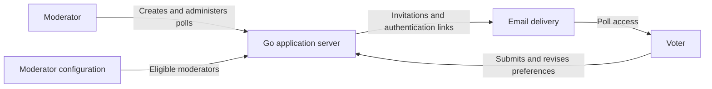

# Architecture

**Status:** Draft conceptual architecture.

**Last updated:** 7 September 2026.

The polling application brings together poll administration, invitations,
passwordless access, ranked ballots, and a closing deadline. Counting follows
Ireland's national rules for proportional representation by the Single
Transferable Vote (PR-STV). The moderator specifies the number of winning options
when creating a poll, equivalent to the number of seats in a constituency.

The application performs the count automatically. Automatic execution is the
intended difference from the manual Irish count; the counting rules remain the
same.

The application preserves one effective vote per participant while allowing that
participant to revise their preferences before the poll closes. A participant
may have several email addresses, all providing access to the same voting record
for a poll.

This document describes the system boundary, domain concepts, and allocation of
responsibilities implied by the [product brief](../README.md) and developed in
the [vision](VISION.md). It records the Go application server as the owner of
interactions and user experience. Frameworks, storage, detailed interfaces, and
authentication mechanisms beyond the stated magic-link requirement remain for
solution design.

## Architectural principles

- **Irish PR-STV governs the count.** The number of winning options is a property
  of the poll set by its moderator. Voting instructions remain simple even when
  the count must handle complex transfers or edge cases. The application carries
  out the count automatically using those rules.
- **Explain the task plainly.** Invitations are short. Voting instructions and
  a separate counting explanation are readily available from the voting page.
  Voter-facing help discusses the poll without national or electoral framing.
- **Go drives the experience.** All interactions and user experience are driven
  by the Go application server.
- **Avoid JavaScript.** JavaScript is permitted only where absolutely
  unavoidable.
- **One participant, one vote per poll.** Multiple email addresses provide access
  to the same participant record and ballot.
- **Reuse suitable existing code.** The upload and writeback projects are the
  first sources to assess when developing the solution design.

## System context

The polling application sits between moderators who establish a poll and voters
who participate in it. Email provides invitations and authentication links.
Moderator eligibility comes from the configuration arrangement named in the
brief.

The diagram shows logical relationships. Its boxes do not prescribe separate
services, processes, or infrastructure.

## Roles and authority

- **Moderator:** defines the poll, specifies the number of winning options,
  adds participants and their email addresses, sets the deadline, and selects
  whether the system should announce the outcome immediately. The moderator can
  inspect results, pause polling, and manually trigger closing and the automatic
  count. A participant list may be reused from an earlier poll and edited before
  invitations are sent. Moderators are pre-configured; the brief does not provide
  a self-registration flow for this role.
- **Voter:** participates in an invited poll, ranks options, and revises their
  own ballot before the deadline.
- **Operator:** supplies the operating environment and configuration required
  by the application. The detailed boundary with Exodan remains governed by its
  applicable contract.

Authentication and permission to act are distinct responsibilities. A magic link
provides the stated means of authentication; moderator eligibility and the
poll's invitation list determine the relevant authority. The unique poll URL
identifies a poll. The relationship between that address and the authentication
link belongs in the later solution design.

Whether moderators are limited to their own polls and whether an invited
moderator may also vote remain product decisions. Pause and manual closing are
established capabilities; other changes after opening remain to be defined.

## Domain concepts

| Concept | Meaning and relationship |
| --- | --- |
| Poll | A question or decision, its options, number of winning options, invited participants, closing deadline, and announcement preference. |
| Option | A choice within a particular poll that a voter may rank. |
| Number of winners | The number of options to be selected by the count, specified by the moderator when creating the poll. It corresponds to constituency seats in Irish PR-STV. |
| Participant list | The participants and their grouped email addresses prepared for a poll. A new list may be based on a previous poll's list and edited before invitations are sent. |
| Participant | One invited person, represented by a record with one or more email addresses and one voting entitlement in the relevant poll. |
| Email address | An invitation and authentication route associated with a participant. Several addresses may lead to the same participant. |
| Invitation | Email access to a particular poll, sent to every address listed for an invited participant. |
| Voter | A participant acting on their voting entitlement, using any of their associated email addresses. |
| Ballot | The participant's current ordered preferences for that poll, shared across all their associated email addresses. A revision changes the effective ballot. |
| Count | Application of Irish PR-STV counting rules to the final eligible ballots, using the poll's number of winners as its seat count. |
| Result | The counted outcome available to the moderator, with automatic announcement controlled by the poll's announcement preference. |
| Announcement preference | The moderator's **announce the winner immediately** checkbox, controlling whether the system announces the counted outcome. |

These are domain concepts, not a database schema. The participant-to-ballot
relationship establishes voting entitlement; who may inspect that relationship
depends on the privacy decisions still to be made.

### Participant identity across email addresses

The participant is the unit of voting entitlement. An email address provides a
way to reach and authenticate that participant. When adding a participant to a
poll, the moderator may enter multiple addresses separated by commas or colons.
Those addresses belong to the same participant record for the poll.

For example, a readers' group member could be entered as
`reader.personal@example.org, reader.group@example.org`. The moderator could
also separate those addresses with a colon. Both addresses receive invitations,
and a magic link used from either address reaches the same participant record
and current ballot. Voting through one address and returning through the other
therefore preserves one effective vote.

The moderator explicitly groups addresses belonging to the same person. This
model does not infer that separately entered participants are the same person.
Handling an email address assigned to more than one participant, and correcting
address groupings after voting begins, remain product decisions.

### Reusing a participant list

A moderator may use a previous poll's participant list as the starting point for
a new poll. The grouping of each participant's email addresses is preserved.
Before sending invitations, the moderator can edit the prepared list, including
adding or removing participants and changing their associated addresses.

The resulting electorate belongs to the new poll. Its preparation does not
modify the earlier poll's electorate or ballots, and previous votes are not
carried forward. The participant has one voting entitlement in each poll in
which they are included. How participant information is represented across polls
is a later storage-design decision.

## Responsibilities within the application

### Poll administration

Poll administration establishes the options, number of winners, electorate,
deadline, and announcement preference, and provides the poll's unique URL. It is
responsible for making the poll's definition available consistently to the other
parts of the application.

It also supports preparing an electorate from a previous poll's participant list.
List preparation and editing precede sending invitations to the new poll, so the
moderator can review who will be invited and which addresses will receive them.

The moderator can pause polling when a problem occurs. From the paused poll,
**Close poll and count results** ends polling and triggers the automatic count.
Other rules for changing a poll after invitations or votes exist remain to be
defined.

### Invitations and access

This responsibility connects the moderator's participants to email invitations
and passwordless authentication. An invitation goes to each address listed for
each participant. Authentication through any of those addresses leads to that
participant's shared voting record for the poll. This responsibility also
distinguishes access to a poll from authority to administer it or submit a ballot.

Invitation messages use the [short invitation copy](VISION.md#invitation-email)
defined in the vision. Each recipient receives the voting link associated with
their address and participant; the email does not carry the detailed counting
explanation.

The concept of a magic link is established in the brief. Link generation,
validation, lifetime, reuse, and the handling of a returning voter are solution
design matters. Comparison with other applications' implementations is deferred
to that work.

### Ballot management

Ballot management receives and maintains a participant's ordered preferences. It
preserves two linked rules: one vote per participant, and unlimited revisions
while polling is open, before the deadline. A revision therefore changes which
preferences represent that vote in the final count, including when the
participant returns through a different associated email address. Paused and
closed polls accept neither new ballots nor revisions.

The voter may rank only some options. The eventual ballot rules need to define
invalid rankings and explain them to the voter; this conceptual architecture
does not select validation or interface mechanisms.

### Deadline and final ballot boundary

The deadline normally ends the period in which voters may change their
preferences. The moderator can also pause polling and then close it manually
through **Close poll and count results**, without waiting for that deadline.
Either route to closing establishes the final ballots used by the count.
Authentication alone does not extend the voting period.

Pausing stops ballot submissions and revisions but does not itself close the
poll, count the votes, or announce a result. Manually triggering a count means
that the moderator initiates it; the application still performs the counting
automatically under the same Irish PR-STV rules.

The product definition needs to settle the precise meaning of submission at the
deadline, how the deadline is presented across timezones, how a pause is ended,
and what happens when the scheduled deadline arrives during a pause. The later
design must give ballot acceptance and counting a consistent interpretation of
those decisions.

### Counting and results

Counting is performed automatically by the application, following Ireland's
national PR-STV rules. Poll options take the role of candidates, and the
moderator's configured number of winners takes the role of constituency seats.
The count uses that number together with the final eligible ballots to determine
the outcome. Automation replaces the manual counting work while retaining the
same rules.

The Electoral Commission's [explanation of Ireland's voting system](https://www.electoralcommission.ie/irelands-voting-system/)
describes the quota, surplus transfers, exclusions, and ballots with no remaining
usable preference. These are responsibilities of the count, while the voter
continues to express an ordered list of preferences.

The detailed national counting reference is Part XIX, Rules for the Counting of
the Votes, of the [Electoral Act 1992](https://www.irishstatutebook.ie/eli/1992/act/23/enacted/en/html).
That link is the enacted text. The solution design must use the applicable rules
and amendments when defining the detailed counting procedure, including ties and
edge cases. The voting system is selected; translating its rules into software
remains later work.

Counting is conceptually separate from invitation delivery and authentication.
The application's invitation, ballot-revision, and deadline rules determine
participation and the final ballots submitted to that count.

The moderator can log in after the deadline to inspect results and the winning
options. Results are also available following a manual close and count. This
access is independent of whether the system announces the outcome.

The **announce the winner immediately** checkbox controls announcement:

- When checked, the system announces the winning outcome as soon as counting
  finishes, including after a manual close and count.
- When unchecked, the system does not announce the outcome. The moderator
  inspects the results and announces the winner outside the system.

The announcement channel, message content, and default checkbox state remain
open decisions. Visibility of individual ballots and the level of counting
detail exposed to participants also remain to be defined.

### Voting guidance

The voting page provides readily available help explaining how to rank
preferences. A separate **How will votes be counted?** link expands the counting
explanation or opens a help page. These interactions follow the Go-driven UX
principle and the restriction on JavaScript.

The [voter-facing copy](VISION.md#voter-facing-copy) in the vision defines the
short invitation and draft explanations. Help uses plain English at a level
understandable by a twelve-year-old and explains both the count and its benefits.
It focuses on the task, without mentioning Ireland, national voting systems, or
elections. Optional further reading links to Wikipedia's Single Transferable
Vote article.

The Irish source references above document the counting authority for development.
They are separate from the voter-facing help.

## Poll journey

1. A configured moderator defines the poll, its options, number of winners,
   participants, closing deadline, and announcement preference, and receives its
   unique URL. The participant list can be reused from an earlier poll and edited
   before invitations are sent. Each participant has one or more email addresses;
   multiple addresses can be separated by commas or colons.
2. Each participant's listed addresses receive invitations. The participant
   authenticates through a magic link received at any of those addresses and
   reaches the same participant record for the poll.
3. Each voter submits an ordered selection of options. Ranking every option is
   optional.
4. A returning voter may revise their preferences any number of times before
   the deadline while polling is open, using any of their associated addresses.
   Each revision still represents the same single vote.
5. Polling normally closes at the deadline. If there is a problem, the moderator
   can pause it and then choose **Close poll and count results**.
6. The application counts the final eligible ballots automatically under Irish
   PR-STV, using the poll's configured number of winners. The moderator can
   inspect the results. The system announces the outcome immediately if the
   checkbox was selected; otherwise the moderator announces it externally.

This is a conceptual journey, not a prescribed state machine or sequence of
technical operations.

## Information and integration boundaries

- **Participation and ballot content:** the application needs to establish
  voting eligibility and preserve one effective vote per participant across all
  their associated addresses. That requirement does not decide who can inspect
  the association between an individual and their preferences.
- **Email delivery:** invitations and authentication depend on email. Delivery
  of an email and acceptance of a ballot are separate events; the voter-facing
  experience needs to distinguish them.
- **Moderator configuration:** the original brief specifies a `.age.yaml` file
  under an Exodan contract. This establishes an integration constraint, but the
  contract's exact format and responsibilities have not been verified here.
- **Application and environment:** poll meaning, eligibility, ballot revision,
  and counting belong to the application's responsibilities. Deployment and
  configuration integration must be reconciled with the Exodan contract during
  solution design.

No storage layout, encryption mechanism, email provider, deployment topology, or
shared authentication component is selected by these boundaries.

## Reuse direction

The upload and writeback projects are intended sources of reusable code, with
their magic-link flows the first candidates to assess. The aim is to shorten the
path to a working polling application by building on suitable existing work.

The later solution design should establish which code can be reused, which needs
adaptation, and which responsibilities remain specific to polling. The approach
to sharing or incorporating that code is also deferred. This draft records the
reuse priority without asserting that a particular component is already suitable.

## Open decisions and later design

The [vision's open decisions](VISION.md#decisions-needed-to-develop-the-vision)
identify the unresolved product questions. Participant corrections, privacy,
announcement delivery, detailed result visibility, and the remaining poll
administration rules need explicit decisions. The Irish PR-STV counting system,
moderator-defined number of winners, announcement choice, and pause-to-close
workflow are established requirements.

The later solution design can then select the technical components and explain
how they uphold those decisions and the Go-driven interaction principle. That
work includes authentication behaviour, data persistence, concurrent ballot
revisions, enforcement of the closing deadline, email failures, and the Exodan
integration. None of those mechanisms is selected by this draft.
